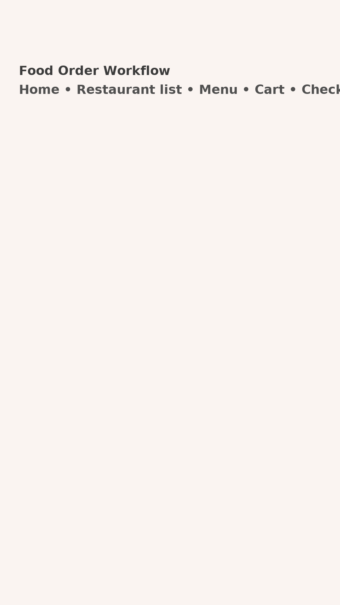

# Food Order Workflow (Flutter)

A single-workflow Flutter app that demonstrates a food ordering flow (like a simplified food delivery app).  
Features:
- BLoC architecture using `flutter_bloc`
- Mock data (no API)
- Realistic workflow: browse restaurants -> view menu -> add to cart -> checkout
- Error handling and checkout failure simulation
- Unit test for BLoC
- SOLID-friendly, modular structure

## Screenshot


## How to run
1. Ensure Flutter SDK is installed (stable channel).  
2. Extract the project and run:
```bash
flutter pub get
flutter run
```

## Tests
Run unit tests:
```bash
flutter test
```

## Notes
This project uses mock data and focuses on architecture, state management, and testability.
